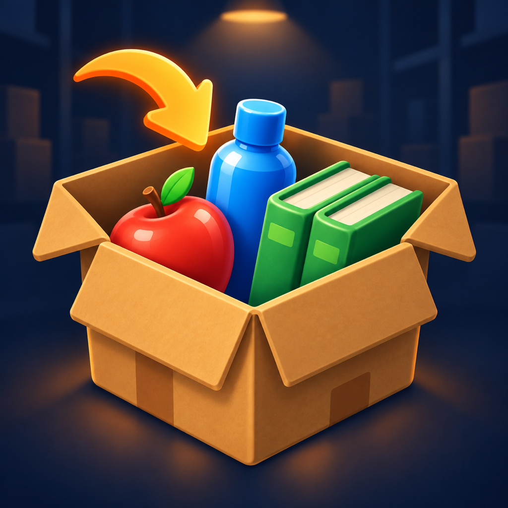
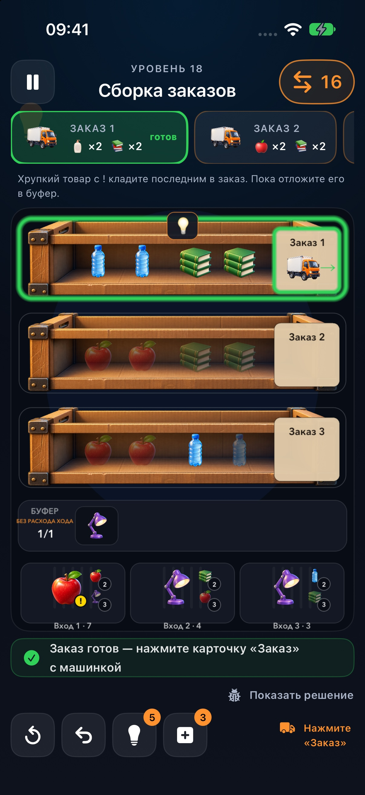

# Warehouse Sort — поддержка

Если у вас есть вопрос об игре или вы заметили ошибку, напишите:

[igorsoloviov77@gmail.com](mailto:igorsoloviov77@gmail.com)

Чтобы помочь быстрее, приложите:

- модель iPhone и версию iOS;
- версию Warehouse Sort;
- номер уровня и описание проблемы;
- снимок экрана, если он помогает показать ошибку.

## Игра Warehouse Sort

Собирайте заказы, сортируйте товары и отправляйте готовые короба нажатием на карточку «Заказ» с машинкой.

## Как отправить готовый заказ?

Когда короб заполнен подходящими товарами, нажмите карточку «Заказ» с машинкой справа от товаров. Заказ с красным маячком отправляется первым.

## Можно ли играть без интернета?

Основная игра доступна без подключения к интернету. Для рекламы и сетевых функций Game Center требуется подключение.

## Где хранится прогресс?

Прогресс сохраняется на устройстве. Не удаляйте приложение, если хотите сохранить текущие результаты. Синхронизация прогресса между устройствами в текущей версии не предусмотрена.

## Как отключить звук и музыку?

Откройте настройки игры. Звук, музыка и тактильная отдача отключаются отдельно.

## Куда отправлять отзывы о тестовой версии?

Откройте Warehouse Sort в TestFlight и выберите отправку отзыва либо напишите на почту поддержки.

---

[Политика конфиденциальности](privacy.html)
